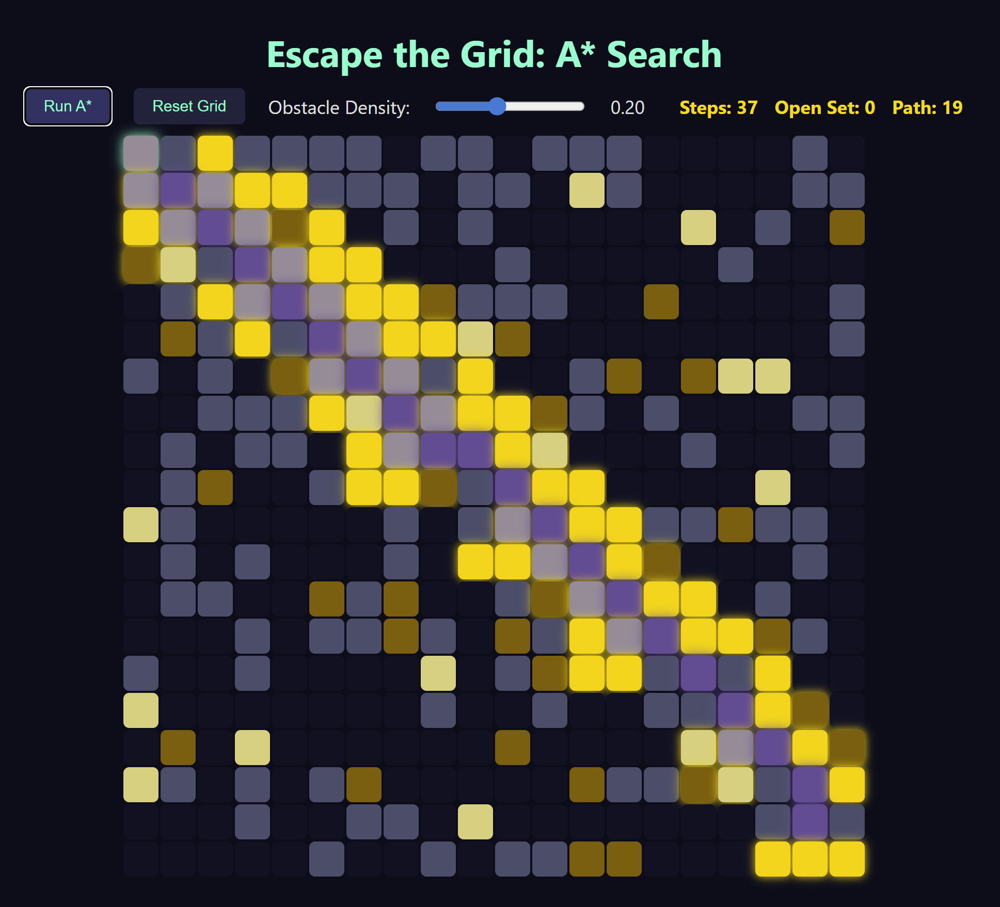

# Brief Report

###  How was weight implemented?

- Weight is set to be 1 unless it is mud or sand, in which case it would have a weight of 2 and 3 respectively. Weight is then used in the moveCost, which is used in the diagonal implementation.

### How was Diagonal movement implemented? 
- First of all, I allowed moves in all 8 directions by adding more to  *const dirs.* 
- Then I calculated moveCost and made a diagonal variable to figure out if the neighbor would be diagonal. If diagonal, movecost would be multiplied by *Math.SQRT2*

### Observations about pathfinding behavior:

- After adding the ablity to go diagonally, it got a lot smarter and faster. It is also very satisfying.  

